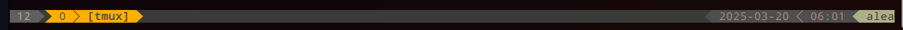

# Personal configurations 

## Overview 
Having to touch a mouse whilst developing software can be considered a [cache](https://en.wikipedia.org/wiki/Cache_(computing)) miss. Switching between using the keyboard and mouse/trackpad slows down productively. This repository contains the configuration files, packages and plugins to allow a developer to avoid using the mouse/trackpad during software development by learning a handful of <kbd>keyboard</kbd> + <kbd>shortcuts</kbd>.

For the *IDE* experience, [vim](https://en.wikipedia.org/wiki/Vim_(text_editor)) - the text editor, and [tmux](https://en.wikipedia.org/wiki/Tmux) - the multiplexer, are combined to allow for this expeirence, along with a colleciton of plugins which faciliates this *"symbiotic"* workflows between the two packages providing the IDE experience at the terminal level.

## Installation
*One-liner*
```bash
curl -s https://raw.githubusercontent.com/akinwilson/configs/refs/heads/main/configs/startup.sh | bash
```
You can run this without cloning the repository on your local machine and as a consequence  you'll have a termianl shell that you'll be able to, if you want to, treat like an IDE, this is achieved by combining aspects of a [multiplexer](https://en.wikipedia.org/wiki/Terminal_multiplexer) and a powerful text editor; `vim`. 

##### **NOTE** 
You need to make **ONE** manual adjustment for the [text package](https://www.nerdfonts.com/) to be loaded with your terminal profile automatically each time you open your terminal to see the shell, such that, for example, the [status bar](https://github.com/rothgar/awesome-tmux#status-bar) of `tmux` is formatted properly. It should appear similar to



Click the <kbd>≡</kbd>  button at the top of the terminal window, RHS side, select `Preferences`, under the `Profiles` section LHS of the window, select the current one (create a `Profile` if it doesn't exist; name can be anything). Under the `Text` tab of the selected `Profile`, third line from the top, tick **Custom font**  use the drop down menu of to the RHS of the tick box to select a font package, select any that contain the word `Nerd Font`; you can do a keyword search for them. Select the appropriate font package, click `apply` and exit the settings. Your `tmux` [status bar](https://github.com/rothgar/awesome-tmux#status-bar) should now format properly in the next terminal you open. Again, it should look similar to this, but obviously with your own hostname etc, 


### Setup
Assuming you have (preferably a clean) installation of the Debian distribution of Linux [Ubuntu](https://ubuntu.com/download), you can review the `config/startup.sh` script to what see exact what packages and CLI tools will be installed along with which configuration files, giving you information about the <kbd>keyboard</kbd>+<kbd>shortcut</kbd> setup and so on.


## Configs 
Please read the `configs/README.md` file  for installation process for `tmux` and `vim` if you want information on setting them up separately, or how it is performed by the `startup.sh` script. There are a few other systems and developer tool packages that are install during  `startup.sh`, like `kubectl`, `minikube`, `docker` for containerised developement and ochestration, along with some others like `net-tools` for network monitoring and analysis. So please review the `config/startup.sh` file before executing it.

## Scripts 
If you tend to use a single machine, you might find this folder `/scripts` useful. This was an old application of a [system service](https://www.freedesktop.org/software/systemd/man/latest/systemctl.html) to automate the process of syncing these configurations with a primary host machine, when changes to the config file where made locally. But I decided to stop using it as I would find myself making changes to the configuration across many machines instead of just one, and saving them, testing them out, and then adjusting these `/config/*` files in this repo after settling for the best configuration, rather than updating this repoistory automaitically when a change was made locally and distributing that change out to any node running the script. Because of the nuance, I don't personally use this `system service`, but it is there for anyone else to make use of if they normally just use one machine, rather than say a work laptop, personal laptop, workstation etc., as in this case, there would not be any issues with it's use. 
